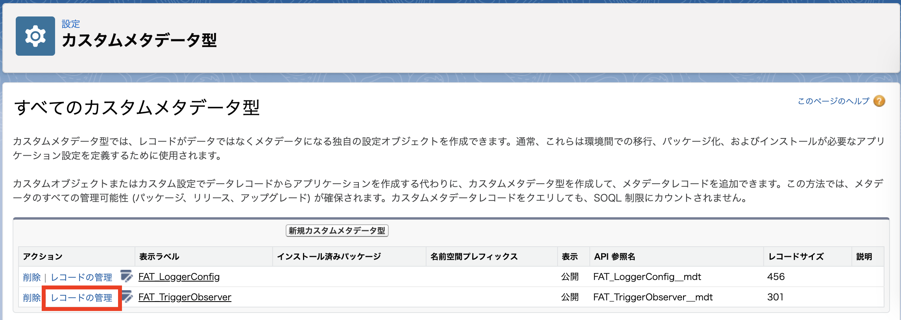
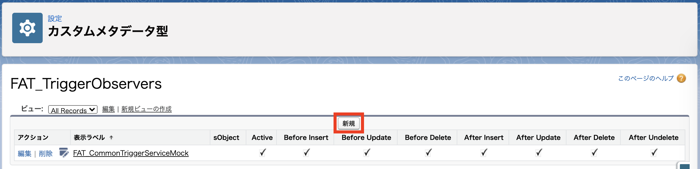
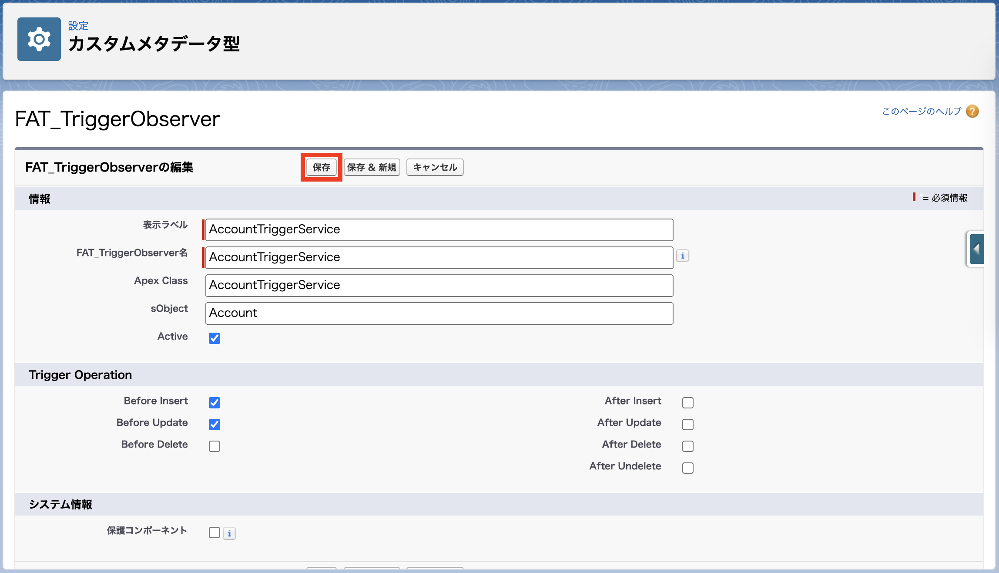

# Lv. 2 の解答

1-1. `sfdx-project.json` に `packageAliases` を追加します。

##### sfdx-project.json

```json
{
  "packageDirectories": [
    {
      "path": "force-app",
      "default": true
    }
  ],
  "namespace": "",
  "sfdcLoginUrl": "https://login.salesforce.com",
  "sourceApiVersion": "49.0",
  "packageAliases": {
    "flexible-apex-trigger@1.0.4.0": "04t2x000003uv9jAAA"
  }
}
```

1-2. `flexible-apex-trigger@1.0.4.0` をインストールします。

```sh
sfdx force:package:install -p flexible-apex-trigger@1.0.4.0 -s AllUsers -u demo
sfdx force:package:install:report -i 0HfXXXXXXXXXXXXXXX -u demo
```

1-3. [Lv. 1](level-01-answer.md) で修正した Apex トリガを修正します。

##### AccountTrigger.trigger

```java
trigger AccountTrigger on Account(before insert, before update) {
  FAT_CommonTriggerHandler handler = FAT_CommonTriggerHandler.create(Account.class);
  handler.invoke();
}
```

1-4. Apex クラスを作成します。

```sh
sfdx force:apex:class:create -d force-app/main/default/classes -n AccountTriggerService -t DefaultApexClass
```

1-5. `FAT_ITriggerObserver` を実装します。

##### AccountTriggerService.cls

```java
@SuppressWarnings('PMD.EmptyStatementBlock,PMD.ApexDoc')
public with sharing class AccountTriggerService implements FAT_ITriggerObserver {
  public void onBeforeInsert(FAT_CommonTriggerHandler handler) {
  }

  public void onBeforeUpdate(FAT_CommonTriggerHandler handler) {
  }

  public void onBeforeDelete(FAT_CommonTriggerHandler handler) {
  }

  public void onAfterInsert(FAT_CommonTriggerHandler handler) {
  }

  public void onAfterUpdate(FAT_CommonTriggerHandler handler) {
  }

  public void onAfterDelete(FAT_CommonTriggerHandler handler) {
  }

  public void onAfterUndelete(FAT_CommonTriggerHandler handler) {
  }
}
```

1-6. `addPrefixToName` および `setCustomerPriority` を追加します。

##### AccountTriggerService.cls

```java
@SuppressWarnings('PMD.EmptyStatementBlock,PMD.ApexDoc')
public with sharing class AccountTriggerService implements FAT_ITriggerObserver {
  @TestVisible
  private void addPrefixToName(List<Account> accounts) {
    for (Account account : accounts) {
      account.Name = '[サンプル] ' + account.Name;
    }
  }

  @TestVisible
  private void setCustomerPriority(List<Account> accounts) {
    for (Account account : accounts) {
      String customerPriority = '';
      switch on account.Rating {
        when 'Hot' {
          customerPriority = 'High';
        }
        when 'Warm' {
          customerPriority = 'Medium';
        }
        when 'Cold' {
          customerPriority = 'Low';
        }
        when else {
        }
      }
      account.CustomerPriority__c = customerPriority;
    }
  }

  public void onBeforeInsert(FAT_CommonTriggerHandler handler) {
  }

  public void onBeforeUpdate(FAT_CommonTriggerHandler handler) {
  }

  public void onBeforeDelete(FAT_CommonTriggerHandler handler) {
  }

  public void onAfterInsert(FAT_CommonTriggerHandler handler) {
  }

  public void onAfterUpdate(FAT_CommonTriggerHandler handler) {
  }

  public void onAfterDelete(FAT_CommonTriggerHandler handler) {
  }

  public void onAfterUndelete(FAT_CommonTriggerHandler handler) {
  }
}
```

1-7. `onBeforeInsert` から `addPrefixToName` および `setCustomerPriority` を呼び出し、
`onBeforeUpdate` から `setCustomerPriority` を呼び出すようにします。

##### AccountTriggerService.cls

```java
@SuppressWarnings('PMD.EmptyStatementBlock,PMD.ApexDoc')
public with sharing class AccountTriggerService implements FAT_ITriggerObserver {
  @TestVisible
  private void addPrefixToName(List<Account> accounts) {
    for (Account account : accounts) {
      account.Name = '[サンプル] ' + account.Name;
    }
  }

  @TestVisible
  private void setCustomerPriority(List<Account> accounts) {
    for (Account account : accounts) {
      String customerPriority = '';
      switch on account.Rating {
        when 'Hot' {
          customerPriority = 'High';
        }
        when 'Warm' {
          customerPriority = 'Medium';
        }
        when 'Cold' {
          customerPriority = 'Low';
        }
        when else {
        }
      }
      account.CustomerPriority__c = customerPriority;
    }
  }

  public void onBeforeInsert(FAT_CommonTriggerHandler handler) {
    this.addPrefixToName((List<Account>) handler.newObjects);
    this.setCustomerPriority((List<Account>) handler.newObjects);
  }

  public void onBeforeUpdate(FAT_CommonTriggerHandler handler) {
    this.setCustomerPriority((List<Account>) handler.newObjects);
  }

  public void onBeforeDelete(FAT_CommonTriggerHandler handler) {
  }

  public void onAfterInsert(FAT_CommonTriggerHandler handler) {
  }

  public void onAfterUpdate(FAT_CommonTriggerHandler handler) {
  }

  public void onAfterDelete(FAT_CommonTriggerHandler handler) {
  }

  public void onAfterUndelete(FAT_CommonTriggerHandler handler) {
  }
}
```

1-8. コードをフォーマットします。

```sh
yarn prettier
```

1-9. スクラッチ組織へプッシュします。

```sh
sfdx force:source:push -u demo
```

2-1. カスタムメタデータ型にレコードを追加するために、スクラッチ組織を開きます。

```sh
sfdx force:org:open -u demo -p lightning/setup/CustomMetadata/home
```

2-2. `FAT_TriggerObserver` の `レコードの管理` をクリックします。



2-3. `新規` をクリックします。



2-4. 情報を入力して `保存` をクリックします。



2-5. 取引先画面を開きます。

```sh
sfdx force:org:open -u demo -p lightning/o/Account/list
```

2-6. 新規ボタンから取引先レコードを新規作成し、想定通りの挙動かどうかを確認しましょう。
また、そのレコードを更新し、想定通りの挙動かどうかを確認しましょう。

... いかがでしたか？
