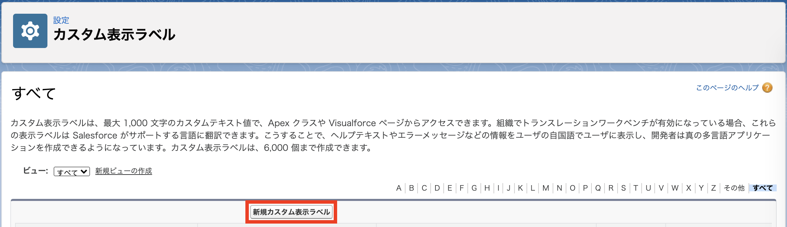

# Lv. 4 の解答

## アウトライン

- [1. カスタムメタデータ型の変更・追加](#1-カスタムメタデータ型の変更・追加)
  - [FAT_TriggerObserver.AccountTriggerService.md-meta.xml](#fat_triggerobserveraccounttriggerservicemd-metaxml)
  - [FAT_TriggerObserver.AccountTriggerValidation.md-meta.xml](#fat_triggerobserveraccounttriggervalidationmd-metaxml)
- [2. カスタム表示ラベルを追加](#2-カスタム表示ラベルを追加)
  - [CustomLabels.labels-meta.xml](#customlabelslabels-metaxml)
- [3. Apex クラスを作成](#3-apex-クラスを作成)
  - [AccountTriggerValidation.cls](#accounttriggervalidationcls)
- [4. Apex テストクラスを作成](#4-apex-テストクラスを作成)
  - [AccountTriggerValidationTest.cls](#accounttriggervalidationtestcls)
- [5. Apex テストクラスを変更](#5-apex-テストクラスを変更)

## 1. カスタムメタデータ型の変更・追加

1-1. カスタムメタデータ型のレコードを修正するために、スクラッチ組織から pull します。

```sh
sfdx force:source:pull -u demo
```

### FAT_TriggerObserver.AccountTriggerService.md-meta.xml

1-2. `force-app/main/default/customMetadata/FAT_TriggerObserver.AccountTriggerService.md-meta.xml` を開いて`BeforeInsert__c`の値を修正します。

**FAT_TriggerObserver.AccountTriggerService.md-meta.xml**

```xml
<?xml version="1.0" encoding="UTF-8" ?>
<CustomMetadata
  xmlns="http://soap.sforce.com/2006/04/metadata"
  xmlns:xsi="http://www.w3.org/2001/XMLSchema-instance"
  xmlns:xsd="http://www.w3.org/2001/XMLSchema"
>
    <label>AccountTriggerService</label>
    <protected>false</protected>
    <values>
        <field>Active__c</field>
        <value xsi:type="xsd:boolean">true</value>
    </values>
    <values>
        <field>AfterDelete__c</field>
        <value xsi:type="xsd:boolean">false</value>
    </values>
    <values>
        <field>AfterInsert__c</field>
        <value xsi:type="xsd:boolean">false</value>
    </values>
    <values>
        <field>AfterUndelete__c</field>
        <value xsi:type="xsd:boolean">false</value>
    </values>
    <values>
        <field>AfterUpdate__c</field>
        <value xsi:type="xsd:boolean">false</value>
    </values>
    <values>
        <field>ApexClass__c</field>
        <value xsi:type="xsd:string">AccountTriggerService</value>
    </values>
    <values>
        <field>BeforeDelete__c</field>
        <value xsi:type="xsd:boolean">false</value>
    </values>
    <values>
        <field>BeforeInsert__c</field>
        <value xsi:type="xsd:boolean">false</value>
    </values>
    <values>
        <field>BeforeUpdate__c</field>
        <value xsi:type="xsd:boolean">true</value>
    </values>
    <values>
        <field>SObject__c</field>
        <value xsi:type="xsd:string">Account</value>
    </values>
</CustomMetadata>
```

### FAT_TriggerObserver.AccountTriggerValidation.md-meta.xml

1-3. `FAT_TriggerObserver.AccountTriggerService.md-meta.xml` をコピーしてカスタムメタデータ型を作成します。

**FAT_TriggerObserver.AccountTriggerValidation.md-meta.xml**

```xml
<?xml version="1.0" encoding="UTF-8" ?>
<CustomMetadata
  xmlns="http://soap.sforce.com/2006/04/metadata"
  xmlns:xsi="http://www.w3.org/2001/XMLSchema-instance"
  xmlns:xsd="http://www.w3.org/2001/XMLSchema"
>
    <label>AccountTriggerValidation</label>
    <protected>false</protected>
    <values>
        <field>Active__c</field>
        <value xsi:type="xsd:boolean">true</value>
    </values>
    <values>
        <field>AfterDelete__c</field>
        <value xsi:type="xsd:boolean">false</value>
    </values>
    <values>
        <field>AfterInsert__c</field>
        <value xsi:type="xsd:boolean">false</value>
    </values>
    <values>
        <field>AfterUndelete__c</field>
        <value xsi:type="xsd:boolean">false</value>
    </values>
    <values>
        <field>AfterUpdate__c</field>
        <value xsi:type="xsd:boolean">false</value>
    </values>
    <values>
        <field>ApexClass__c</field>
        <value xsi:type="xsd:string">AccountTriggerValidation</value>
    </values>
    <values>
        <field>BeforeDelete__c</field>
        <value xsi:type="xsd:boolean">false</value>
    </values>
    <values>
        <field>BeforeInsert__c</field>
        <value xsi:type="xsd:boolean">true</value>
    </values>
    <values>
        <field>BeforeUpdate__c</field>
        <value xsi:type="xsd:boolean">true</value>
    </values>
    <values>
        <field>SObject__c</field>
        <value xsi:type="xsd:string">Account</value>
    </values>
</CustomMetadata>
```

1-4. コードをフォーマットします。

```sh
yarn prettier
```

1-5. スクラッチ組織へプッシュします。

```sh
sfdx force:source:push -u demo
```


---

## 2. カスタム表示ラベルを追加

2-1. カスタム表示ラベルにレコードを追加するために、スクラッチ組織を開きます。

```sh
sfdx force:org:open -u demo -p lightning/setup/ExternalStrings/home
```

2-2. `新規カスタム表示ラベル` をクリックします。



2-3. 情報を入力して `保存` をクリックします。

| 項目名             | 値                                                     | 備考 |
| :----------------- | :----------------------------------------------------- | :--- |
| 簡単な説明         | SLA_EXPIRATION_DATE_REQUIRED                           | -    |
| 名前               | SLA_EXPIRATION_DATE_REQUIRED                           | -    |
| 保護コンポーネント | No                                                     | -    |
| カテゴリ           | ERROR                                                  | -    |
| 値                 | SLA が設定されている場合は有効期限も入力してください。 | -    |


2-4. カスタム表示ラベルのレコードを追加するために、スクラッチ組織から pull します。

```sh
sfdx force:source:pull -u demo
```

### CustomLabels.labels-meta.xml

2-5. `force-app/main/default/labels/CustomLabels.labels-meta.xml` を開いてカスタム表示ラベルを追加します。

**CustomLabels.labels-meta.xml**

- SLA_SERIAL_NUMBER_REQUIRED

```xml
<?xml version="1.0" encoding="UTF-8" ?>
<CustomLabels xmlns="http://soap.sforce.com/2006/04/metadata">
    <labels>
        <fullName>SLA_EXPIRATION_DATE_REQUIRED</fullName>
        <categories>ERROR</categories>
        <language>ja</language>
        <protected>false</protected>
        <shortDescription>SLA_EXPIRATION_DATE_REQUIRED</shortDescription>
        <value>SLA が設定されている場合は有効期限も入力してください。</value>
    </labels>
    <labels>
        <fullName>SLA_SERIAL_NUMBER_REQUIRED</fullName>
        <categories>ERROR</categories>
        <language>ja</language>
        <protected>false</protected>
        <shortDescription>SLA_SERIAL_NUMBER_REQUIRED</shortDescription>
        <value
    >SLA が設定されている場合はシリアルナンバーも入力してください。</value>
    </labels>
</CustomLabels>
```

2-6. コードをフォーマットします。

```sh
yarn prettier
```

2-7. スクラッチ組織へプッシュします。

```sh
sfdx force:source:push -u demo
```


---

## 3. Apex クラスを作成

3-1. Apex クラスを作成します。

### AccountTriggerValidation.cls

```sh
sfdx force:apex:class:create -d force-app/main/default/classes -n AccountTriggerValidation -t DefaultApexClass
```

3-2. `FAT_ITriggerObserver` を実装します。

**AccountTriggerValidation.cls**

```java
@SuppressWarnings('PMD.EmptyStatementBlock,PMD.ApexDoc')
public with sharing class AccountTriggerValidation implements FAT_ITriggerObserver {
  public void onBeforeInsert(FAT_CommonTriggerHandler handler) {
  }

  public void onBeforeUpdate(FAT_CommonTriggerHandler handler) {
  }

  public void onBeforeDelete(FAT_CommonTriggerHandler handler) {
  }

  public void onAfterInsert(FAT_CommonTriggerHandler handler) {
  }

  public void onAfterUpdate(FAT_CommonTriggerHandler handler) {
  }

  public void onAfterDelete(FAT_CommonTriggerHandler handler) {
  }

  public void onAfterUndelete(FAT_CommonTriggerHandler handler) {
  }
}
```

3-3. `validateSLA` を追加します。

**AccountTriggerValidation.cls**

```java
@SuppressWarnings('PMD.EmptyStatementBlock,PMD.ApexDoc')
public with sharing class AccountTriggerValidation implements FAT_ITriggerObserver {
  private static final String SLA_EXPIRATION_DATE_REQUIRED = System.Label.SLA_EXPIRATION_DATE_REQUIRED;
  private static final String SLA_SERIAL_NUMBER_REQUIRED = System.Label.SLA_SERIAL_NUMBER_REQUIRED;

  public class CustomException extends Exception {
  }

  @TestVisible
  private void validateSLA(List<Account> accounts) {
    for (Account account : accounts) {
      Boolean hasSLA = String.isNotEmpty(account.SLA__c);
      Boolean hasSLAExpirationDate = String.isNotEmpty(
        String.valueOf(account.SLAExpirationDate__c)
      );
      Boolean hasSLASerialNumber = String.isNotEmpty(
        account.SLASerialNumber__c
      );

      String errorMessage = '';
      if (hasSLA && !hasSLAExpirationDate) {
        account.SLAExpirationDate__c.addError(SLA_EXPIRATION_DATE_REQUIRED);
        errorMessage += SLA_EXPIRATION_DATE_REQUIRED;
      }
      if (hasSLA && !hasSLASerialNumber) {
        account.SLASerialNumber__c.addError(SLA_SERIAL_NUMBER_REQUIRED);
        errorMessage += SLA_SERIAL_NUMBER_REQUIRED;
      }

      Boolean hasErrorMessage = String.isNotEmpty(errorMessage);
      if (hasErrorMessage) {
        CustomException e = new CustomException();
        e.setMessage(errorMessage);
        throw e;
      }
    }
  }

  public void onBeforeInsert(FAT_CommonTriggerHandler handler) {
  }

  public void onBeforeUpdate(FAT_CommonTriggerHandler handler) {
  }

  public void onBeforeDelete(FAT_CommonTriggerHandler handler) {
  }

  public void onAfterInsert(FAT_CommonTriggerHandler handler) {
  }

  public void onAfterUpdate(FAT_CommonTriggerHandler handler) {
  }

  public void onAfterDelete(FAT_CommonTriggerHandler handler) {
  }

  public void onAfterUndelete(FAT_CommonTriggerHandler handler) {
  }
}
```

3-4. `onBeforeInsert` から `validateSLA` を呼び出し、`onBeforeUpdate` から `validateSLA` を呼び出すようにします。

**AccountTriggerValidation.cls**

```java
@SuppressWarnings('PMD.EmptyStatementBlock,PMD.ApexDoc')
public with sharing class AccountTriggerValidation implements FAT_ITriggerObserver {
  private static final String SLA_EXPIRATION_DATE_REQUIRED = System.Label.SLA_EXPIRATION_DATE_REQUIRED;
  private static final String SLA_SERIAL_NUMBER_REQUIRED = System.Label.SLA_SERIAL_NUMBER_REQUIRED;

  public class CustomException extends Exception {
  }

  @TestVisible
  private void validateSLA(List<Account> accounts) {
    for (Account account : accounts) {
      Boolean hasSLA = String.isNotEmpty(account.SLA__c);
      Boolean hasSLAExpirationDate = String.isNotEmpty(
        String.valueOf(account.SLAExpirationDate__c)
      );
      Boolean hasSLASerialNumber = String.isNotEmpty(
        account.SLASerialNumber__c
      );

      String errorMessage = '';
      if (hasSLA && !hasSLAExpirationDate) {
        account.SLAExpirationDate__c.addError(SLA_EXPIRATION_DATE_REQUIRED);
        errorMessage += SLA_EXPIRATION_DATE_REQUIRED;
      }
      if (hasSLA && !hasSLASerialNumber) {
        account.SLASerialNumber__c.addError(SLA_SERIAL_NUMBER_REQUIRED);
        errorMessage += SLA_SERIAL_NUMBER_REQUIRED;
      }

      Boolean hasErrorMessage = String.isNotEmpty(errorMessage);
      if (hasErrorMessage) {
        CustomException e = new CustomException();
        e.setMessage(errorMessage);
        throw e;
      }
    }
  }

  public void onBeforeInsert(FAT_CommonTriggerHandler handler) {
    this.validateSLA((List<Account>) handler.newObjects);
  }

  public void onBeforeUpdate(FAT_CommonTriggerHandler handler) {
    this.validateSLA((List<Account>) handler.newObjects);
  }

  public void onBeforeDelete(FAT_CommonTriggerHandler handler) {
  }

  public void onAfterInsert(FAT_CommonTriggerHandler handler) {
  }

  public void onAfterUpdate(FAT_CommonTriggerHandler handler) {
  }

  public void onAfterDelete(FAT_CommonTriggerHandler handler) {
  }

  public void onAfterUndelete(FAT_CommonTriggerHandler handler) {
  }
}
```

3-5. コードをフォーマットします。

```sh
yarn prettier
```

3-6. スクラッチ組織へプッシュします。

```sh
sfdx force:source:push -u demo
```

---

## 4. Apex テストクラスを作成

4-1. Apex テストを実行して現在のコードカバー率を確認します。

```sh
export SFDX_IMPROVED_CODE_COVERAGE="true"

sfdx force:apex:test:run -c -l RunLocalTests -r human -u demo
```

```sh
=== Apex Code Coverage
ID                  NAME                           % COVERED  UNCOVERED LINES
──────────────────  ─────────────────────────────  ─────────  ───────────────────────────────────
01p1m000000dNwKAAU  FAT_CommonConstants            NaN%
01p1m000000dNwLAAU  FAT_CommonError                100%
01p1m000000dNwYAAU  FAT_CommonUtils                100%
01p1m000000dNwOAAU  FAT_CommonLoggerConstants      100%
01p1m000000dNwNAAU  FAT_CommonLogger               100%
01p1m000000dNwPAAU  FAT_CommonLoggerHelper         100%
01q1m000000EAWXAA4  FAT_LoggerEventTrigger         100%
01p1m000000dNwbAAE  FAT_LoggerEventTriggerService  100%
01p1m000000dNwTAAU  FAT_CommonTriggerHandler       98%        216,217
01p1m000000dNwVAAU  FAT_CommonTriggerHelper        100%
01q1m000000E9UvAAK  AccountTrigger                 100%
01p1m000000dO0mAAE  AccountTriggerService          100%
01p1m000000dWaeAAE  AccountTriggerValidation       60%        21,22,25,26,31,32,33,46,49,52,55,58

=== Test Summary
NAME                 VALUE
───────────────────  ─────────────────────────────────────────────────────────
Outcome              Passed
Tests Ran            58
Passing              58
Failing              0
Skipped              0
Pass Rate            100%
Fail Rate            0%
Test Run Coverage    96%
Org Wide Coverage    96%
```

### AccountTriggerValidationTest.cls

4-2. `AccountTriggerValidationTest.cls` の Apex テストクラスを作成します。

```sh
sfdx force:apex:class:create -d force-app/test/default/classes -n AccountTriggerValidationTest -t ApexUnitTest
```

**AccountTriggerValidationTest.cls**

```java
@isTest(SeeAllData=false)
private class AccountTriggerValidationTest {
  private static final String SLA_EXPIRATION_DATE_REQUIRED = System.Label.SLA_EXPIRATION_DATE_REQUIRED;
  private static final String SLA_SERIAL_NUMBER_REQUIRED = System.Label.SLA_SERIAL_NUMBER_REQUIRED;
  private static AccountTriggerValidation validation = new AccountTriggerValidation();
  private static FAT_CommonTriggerHandler handler = FAT_CommonTriggerHandler.create(
    Account.class
  );

  @isTest
  static void validateSLAErrorSLAExpirationDate() {
    List<Account> accounts = new List<Account>();
    Account account = new Account();
    account.Name = 'Demo';
    account.SLA__c = 'Gold';
    account.SLAExpirationDate__c = null;
    account.SLASerialNumber__c = '0';
    accounts.add(account);

    Test.startTest();
    List<Boolean> exceptions = new List<Boolean>();
    try {
      validation.validateSLA(accounts);
    } catch (Exception e) {
      exceptions.add(true);
      String message = e.getMessage();
      System.assertEquals(
        SLA_EXPIRATION_DATE_REQUIRED,
        message,
        'validateSLAErrorSLAExpirationDate'
      );
    }
    Test.stopTest();

    for (Boolean b : exceptions) {
      System.assertEquals(true, b, 'validateSLAErrorSLAExpirationDate');
    }
  }

  @isTest
  static void validateSLAErrorSLASerialNumber() {
    List<Account> accounts = new List<Account>();
    Account account = new Account();
    account.Name = 'Demo';
    account.SLA__c = 'Gold';
    account.SLAExpirationDate__c = Date.today();
    account.SLASerialNumber__c = null;
    accounts.add(account);

    Test.startTest();
    List<Boolean> exceptions = new List<Boolean>();
    try {
      validation.validateSLA(accounts);
    } catch (Exception e) {
      exceptions.add(true);
      String message = e.getMessage();
      System.assertEquals(
        SLA_SERIAL_NUMBER_REQUIRED,
        message,
        'validateSLAErrorSLASerialNumber'
      );
    }
    Test.stopTest();

    for (Boolean b : exceptions) {
      System.assertEquals(true, b, 'validateSLAErrorSLASerialNumber');
    }
  }

  @isTest
  static void onBeforeInsert() {
    List<Account> accounts = new List<Account>();
    handler.newObjects = accounts;

    Test.startTest();
    validation.onBeforeInsert(handler);
    Test.stopTest();

    System.assertNotEquals(null, handler, 'onBeforeInsert');
  }

  @isTest
  static void onBeforeUpdate() {
    List<Account> accounts = new List<Account>();
    handler.newObjects = accounts;

    Test.startTest();
    validation.onBeforeUpdate(handler);
    Test.stopTest();

    System.assertNotEquals(null, handler, 'onBeforeInsert');
  }

  @isTest
  static void onBeforeDelete() {
    Test.startTest();
    validation.onBeforeDelete(handler);
    Test.stopTest();

    System.assertNotEquals(null, handler, 'onBeforeDelete');
  }

  @isTest
  static void onAfterInsert() {
    Test.startTest();
    validation.onAfterInsert(handler);
    Test.stopTest();

    System.assertNotEquals(null, handler, 'onAfterInsert');
  }

  @isTest
  static void onAfterUpdate() {
    Test.startTest();
    validation.onAfterUpdate(handler);
    Test.stopTest();

    System.assertNotEquals(null, handler, 'onAfterUpdate');
  }

  @isTest
  static void onAfterDelete() {
    Test.startTest();
    validation.onAfterDelete(handler);
    Test.stopTest();

    System.assertNotEquals(null, handler, 'onAfterDelete');
  }

  @isTest
  static void onAfterUndelete() {
    Test.startTest();
    validation.onAfterUndelete(handler);
    Test.stopTest();

    System.assertNotEquals(null, handler, 'onAfterUndelete');
  }
}
```

4-3. コードをフォーマットします。

```sh
yarn prettier
```

4-4. スクラッチ組織へプッシュします。

```sh
sfdx force:source:push -u demo
```

4-5. Apex テストを実行して現在のコードカバー率を確認します。

```sh
export SFDX_IMPROVED_CODE_COVERAGE="true"

sfdx force:apex:test:run -c -l RunLocalTests -r human -u demo
```

```sh
=== Apex Code Coverage
ID                  NAME                           % COVERED  UNCOVERED LINES
──────────────────  ─────────────────────────────  ─────────  ───────────────
01p0l0000027mMmAAI  FAT_CommonConstants            NaN%
01p0l0000027mMnAAI  FAT_CommonError                100%
01p0l0000027mMpAAI  FAT_CommonLogger               100%
01p0l0000027mMqAAI  FAT_CommonLoggerConstants      100%
01p0l0000027mMrAAI  FAT_CommonLoggerHelper         100%
01p0l0000027mMvAAI  FAT_CommonTriggerHandler       98%        216,217
01p0l0000027mMxAAI  FAT_CommonTriggerHelper        100%
01p0l0000027mN0AAI  FAT_CommonUtils                100%
01q0l000000HcL0AAK  FAT_LoggerEventTrigger         100%
01p0l0000027mN3AAI  FAT_LoggerEventTriggerService  100%
01q0l000000HcL5AAK  AccountTrigger                 100%
01p0l0000027mN7AAI  AccountTriggerService          100%
01p0l0000027mNAAAY  AccountTriggerValidation       100%

=== Test Summary
NAME                 VALUE
───────────────────  ────────────────────────────────────────────────────────────
Outcome              Passed
Tests Ran            65
Passing              65
Failing              0
Skipped              0
Pass Rate            100%
Fail Rate            0%
Test Run Coverage    99%
Org Wide Coverage    99%
```

---

## 5. Apex テストクラスを変更

5-1. `AccountTestUtils.cls` に `createAbnormalAccounts` を追加します。

**AccountTestUtils.cls**

```java
@SuppressWarnings('PMD.ApexDoc')
@isTest(SeeAllData=false)
public with sharing class AccountTestUtils {
  public static List<Account> createNormalAccounts() {
    List<Account> accounts = new List<Account>();

    Account account1 = new Account();
    account1.Name = 'Demo1';
    account1.Rating = 'Hot';
    accounts.add(account1);

    return accounts;
  }

  public static List<Account> createAbnormalAccounts() {
    List<Account> accounts = new List<Account>();

    Account account2 = new Account();
    account2.Name = 'Demo2';
    account2.SLA__c = 'Gold';
    account2.SLAExpirationDate__c = null;
    account2.SLASerialNumber__c = null;
    accounts.add(account2);

    return accounts;
  }

  public static List<Account> selectAccounts() {
    return [
      SELECT Id, Name, Rating, CustomerPriority__c
      FROM Account
      ORDER BY Name ASC
      LIMIT 50000
    ];
  }

  public static void insertAccounts(List<Account> accounts) {
    List<Database.SaveResult> results = Database.insert(accounts, false);
  }

  public static void updateAccounts(List<Account> accounts) {
    List<Database.SaveResult> results = Database.update(accounts, false);
  }

  public static void deleteAccounts(List<Account> accounts) {
    List<Database.DeleteResult> results = Database.delete(accounts, false);
  }

  public static void undeleteAccounts(List<Account> accounts) {
    List<Database.UndeleteResult> results = Database.undelete(accounts, false);
  }
}
```

5-2. `AccountTriggerTest.cls` の `invokeException` にコードを追加します。

**AccountTriggerTest.cls**

```java
@isTest(SeeAllData=false)
private class AccountTriggerTest {
  @testSetup
  static void setup() {
    List<Account> accounts = AccountTestUtils.createNormalAccounts();
    AccountTestUtils.insertAccounts(accounts);
  }

  @isTest
  static void invokeUpdate() {
    List<Account> accounts = AccountTestUtils.selectAccounts();

    Test.startTest();
    AccountTestUtils.updateAccounts(accounts);
    Test.stopTest();

    System.assertNotEquals(0, accounts.size(), 'invokeUpdate');
  }

  @isTest
  static void invokeDelete() {
    List<Account> accounts = AccountTestUtils.selectAccounts();
    AccountTestUtils.deleteAccounts(accounts);

    Test.startTest();
    AccountTestUtils.undeleteAccounts(accounts);
    Test.stopTest();

    System.assertNotEquals(0, accounts.size(), 'invokeDelete');
  }

  @isTest
  static void invokeException() {
    List<Account> accounts = AccountTestUtils.createAbnormalAccounts();

    Test.startTest();
    AccountTestUtils.insertAccounts(accounts);
    Test.stopTest();

    System.assertNotEquals(0, accounts.size(), 'invokeException');
  }
}
```

5-3. コードをフォーマットします。

```sh
yarn prettier
```

5-4. スクラッチ組織へプッシュします。

```sh
sfdx force:source:push -u demo
```

5-5. Apex テストを実行して現在のコードカバー率を確認します。

```sh
export SFDX_IMPROVED_CODE_COVERAGE="true"

sfdx force:apex:test:run -c -l RunLocalTests -r human -u demo
```

```sh
=== Apex Code Coverage
ID                  NAME                           % COVERED  UNCOVERED LINES
──────────────────  ─────────────────────────────  ─────────  ───────────────
01p0l0000027mMmAAI  FAT_CommonConstants            NaN%
01p0l0000027mMnAAI  FAT_CommonError                100%
01p0l0000027mMpAAI  FAT_CommonLogger               100%
01p0l0000027mMqAAI  FAT_CommonLoggerConstants      100%
01p0l0000027mMrAAI  FAT_CommonLoggerHelper         100%
01p0l0000027mMvAAI  FAT_CommonTriggerHandler       100%
01p0l0000027mMxAAI  FAT_CommonTriggerHelper        100%
01p0l0000027mN0AAI  FAT_CommonUtils                100%
01q0l000000HcL0AAK  FAT_LoggerEventTrigger         100%
01p0l0000027mN3AAI  FAT_LoggerEventTriggerService  100%
01q0l000000HcL5AAK  AccountTrigger                 100%
01p0l0000027mN7AAI  AccountTriggerService          100%
01p0l0000027mNAAAY  AccountTriggerValidation       100%

=== Test Summary
NAME                 VALUE
───────────────────  ────────────────────────────────────────────────────────────
Outcome              Passed
Tests Ran            65
Passing              65
Failing              0
Skipped              0
Pass Rate            100%
Fail Rate            0%
Test Run Coverage    100%
Org Wide Coverage    100%
```

コードカバー率が 100%になりました！

入力規則の動作確認もしてみましょう。取引先画面を開いて、新規ボタンから取引先レコードを新規作成し、想定通りの挙動かどうかを確認しましょう。
また、そのレコードを更新し、想定通りの挙動かどうかを確認しましょう。

... いかがでしたか？
